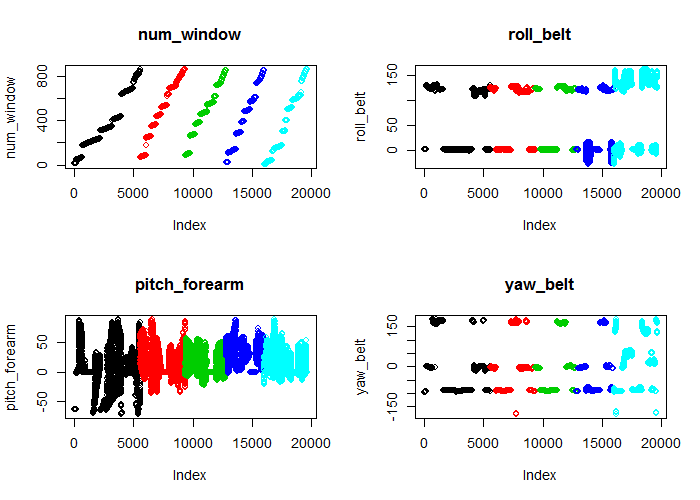

# Measure How Well People Perform Weight Lifting Exercises
Natalie Phillips  
29 August 2016  


## Synopsis

It is now common for people to measure how much of an activity they are doing.
It is less common for people to measure how well are completing an activity.
It is possible to accruately predict whether barbell lifts have been performed 
correctly as the analysis below demostrates. This ability to predict how a person
is moving has great implications for automated coaching and feedback for people
both in and out of home and the gym.

A group of volunteers were asked to lift dumbells in an exercise called *Unilateral Dumbbell Biceps Curl*. They were asked to lift the weights using the correct technique or
one of four common errors.

Label for lift     |   Lift technique
-----------      |   --------------
class A         |   correct lift
class B         |   throwing elbows to the front
class C         |   lifting only half way
class D         |   lowering only half way
class E         |   throwing hips to the front.

The excercise was measured using sensors called accelerometers on various parts of the body as well 
as the dumbells. Sensors were placed on:

* arm
* forearm
* belt
* dumbell.

## Loading and processing data

First the data were first downloaded. A check is performed to see if the data were already there so the download only occurs once.


The data were presplit into a testing set and a training set where were then loaded into R. During the load both *NA* and *#DIV/0!* were read as *NA* strings.


```r
train <- read.csv(".\\data\\pml-training.csv",
                  na.strings = c("NA", "#DIV/0!")
                  )
test <- read.csv(".\\data\\pml-testing.csv",
                 na.strings = c("NA", "#DIV/0!")
                    )
```

The train set has 160 variables and 19622 observations. The test set has the same number of variables less the *classe* (results) column and 20 observations.

Cleaning of the data was performed in three ways:

* where most of the measurements were $NA$s the variable was removed
* names dates and indexes are not relevant to the prediction so were removed
* one outlier was removed.

There was one outlier value, well outside the range of the rest of the values,  which could have been caused by a miss read on the sensors or perhaps dropped equipment.


Not all of the variables are useful for our model. It turns out some variables
contained mainly NA values which were removed below.


```r
library(plyr)
library(dplyr)
# Remove rows containing mainly NAs
nmissing <- function(x) {
    sum(is.na(x))   # Calculate the number of NAs
}

NA_Col <- which(colwise(nmissing)(train) > 19000)
train2 <- train[, -NA_Col] # Remove columns with NAs

# Remove names and dates
train2 <- train2[, -(1:5)]

# Remove outlier
summary(train2$gyros_dumbbell_x)
```

```
     Min.   1st Qu.    Median      Mean   3rd Qu.      Max. 
-204.0000   -0.0300    0.1300    0.1611    0.3500    2.2200 
```

```r
locat <- which(train2$gyros_dumbbell_x < -10)
train2 <- train2[-locat, ]
```

The cleaned training set has 55 variables and 19621 observations. The outlier was skewing the data and removing it has allowed data for some of the variables to be less skewed. For example take the variable *gyros_dumbbell_x*.You can see the change that occurs when removing the outlier:


<div class="rimage center"></div>

## Random Forest model

I chose Random Forests methods to model the type of movement performed by the
subject due to its accuracy and the fact that the data do not appear normal. No other preprocessing in the form of scaling or reshaping was performed as the Random Forest method does not require it. 

Error was calculated using k-fold Cross Validation with 10 foldes. Cross Validation should provide a reasonable out of sample estimate.

Unfortunately the computer I was using for machine learning could not build a model with all of training observations provided. I used around 30% observation to make the calculations more manageable. The data left out of the taining model 
was used to validate the model once it was built.


```r
library(caret)
library(rpart)

# Make the size more manageable and speed up computations
set.seed(1375)
trainSmall <- createDataPartition(y = train2$classe, p = 0.3, list = FALSE)
train3 <- train2[trainSmall, ]

# Train the Random Forest model with 10 fold Cross Validations 
modelRF <- train(classe ~ .,
                  data = train3,
                  method = "rf",
                  trControl = trainControl(method = "cv", number = 10),
                  prox = TRUE)
```

The model has over an 98% accuracy as seen in the confusion matrix below:

```r
confusionMatrix(modelRF)
```

```
Cross-Validated (10 fold) Confusion Matrix 

(entries are percentual average cell counts across resamples)
 
          Reference
Prediction    A    B    C    D    E
         A 28.4  0.3  0.0  0.0  0.0
         B  0.0 18.9  0.2  0.0  0.1
         C  0.0  0.2 17.2  0.3  0.0
         D  0.0  0.0  0.1 16.0  0.1
         E  0.0  0.0  0.0  0.0 18.2
                            
 Accuracy (average) : 0.9871
```

This model was applied to the 20 observation test set and independently verified to be 100% successfull.

## Validation

Training data, not used to build the model, was used to test the prediction model. We don't need to perform any preprocessing as no transformations were performed. Also the prediction model will only references those columns named in the model.


```r
# Predicting using the remaining training data
test2 <- train2[-trainSmall, ]
pred <- predict(modelRF, test2)
confusionMatrix(pred, test2$classe)
```

```
Confusion Matrix and Statistics

          Reference
Prediction    A    B    C    D    E
         A 3904   17    0    0    0
         B    1 2614   17    0    3
         C    0   25 2373   32    1
         D    0    1    5 2219   16
         E    0    0    0    0 2504

Overall Statistics
                                          
               Accuracy : 0.9914          
                 95% CI : (0.9897, 0.9929)
    No Information Rate : 0.2844          
    P-Value [Acc > NIR] : < 2.2e-16       
                                          
                  Kappa : 0.9891          
 Mcnemar's Test P-Value : NA              

Statistics by Class:

                     Class: A Class: B Class: C Class: D Class: E
Sensitivity            0.9997   0.9838   0.9908   0.9858   0.9921
Specificity            0.9983   0.9981   0.9949   0.9981   1.0000
Pos Pred Value         0.9957   0.9920   0.9761   0.9902   1.0000
Neg Pred Value         0.9999   0.9961   0.9981   0.9972   0.9982
Prevalence             0.2844   0.1935   0.1744   0.1639   0.1838
Detection Rate         0.2843   0.1904   0.1728   0.1616   0.1823
Detection Prevalence   0.2855   0.1919   0.1770   0.1632   0.1823
Balanced Accuracy      0.9990   0.9910   0.9928   0.9919   0.9960
```

The Confusion Matrix shows the predicted value down the left hand side and the 
correct observed values across the top. See that most of the predicted values
agreed with the observered values. The out of the bag Accuracy is over 99%. 

## Variables with the most impact on the model

The most important variables according to the model were


```r
varImp(modelRF)
```

```
rf variable importance

  only 20 most important variables shown (out of 54)

                     Overall
num_window           100.000
roll_belt             83.390
pitch_forearm         52.783
yaw_belt              38.160
magnet_dumbbell_z     37.594
magnet_dumbbell_y     36.549
pitch_belt            34.199
roll_forearm          34.125
accel_dumbbell_y      18.480
roll_dumbbell         17.688
accel_forearm_x       14.994
magnet_dumbbell_x     14.216
accel_belt_z          13.433
magnet_belt_z         12.000
accel_dumbbell_z      11.809
magnet_belt_y         11.554
total_accel_dumbbell  11.497
magnet_forearm_z       9.935
magnet_belt_x          9.748
yaw_dumbbell           8.259
```

The four variables with the most impact on the model are shown below. The Class of movement is shown in colour:

* black - class A
* red - class B
* green - class C
* dark blue - class D
* light blue - class E

<div class="rimage center"></div>

## Conclusions
With over 99% accuracy this model shows just how accurately technique in the gym can be captured. This will likely open up many new coaching applications and gadgets in the fitness industry and beyond.


## Citation

I gratefully cite this paper and data collection work which made this analysis possible.

Velloso, E.; Bulling, A.; Gellersen, H.; Ugulino, W.; Fuks, H. **Qualitative Activity Recognition of Weight Lifting Exercises**. Proceedings of 4th International Conference in Cooperation with SIGCHI (Augmented Human '13) . Stuttgart, Germany: ACM SIGCHI, 2013.

## Further work

* It appears one of the most important measures when predicting how well an excercise
is performed is **num_window**. This value may not be known outside of
an experimental environment. Perhaps next time this variable along with **new_window**
should be removed.

* A more powerful machine would enable the Random Forest model to be built using all of the observations which may improve the accuracy some what.
